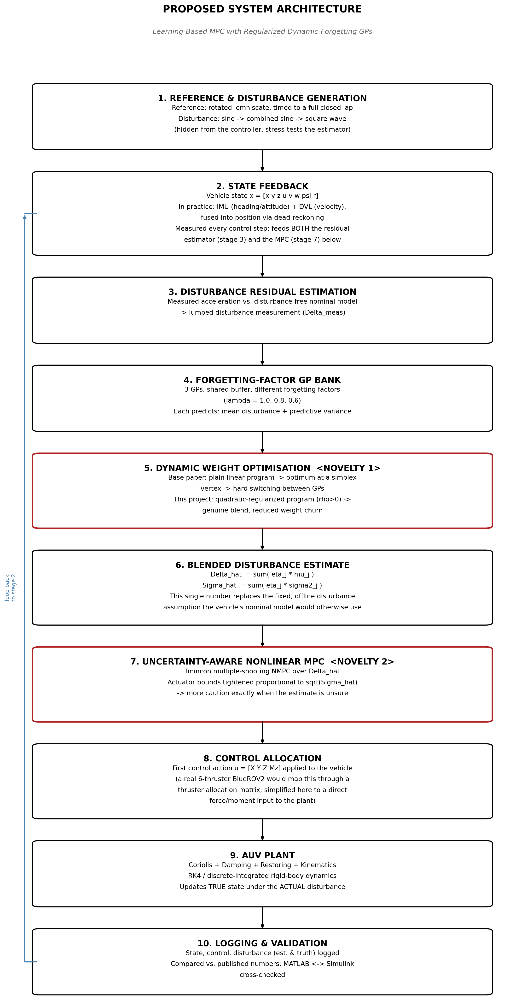
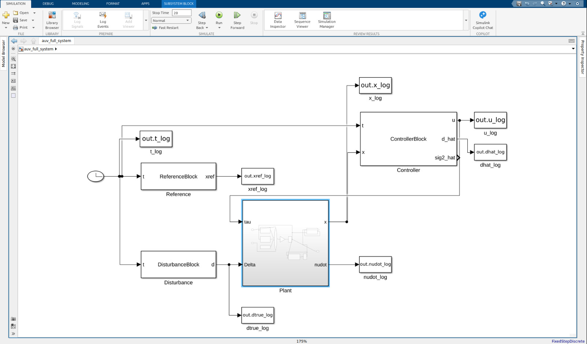
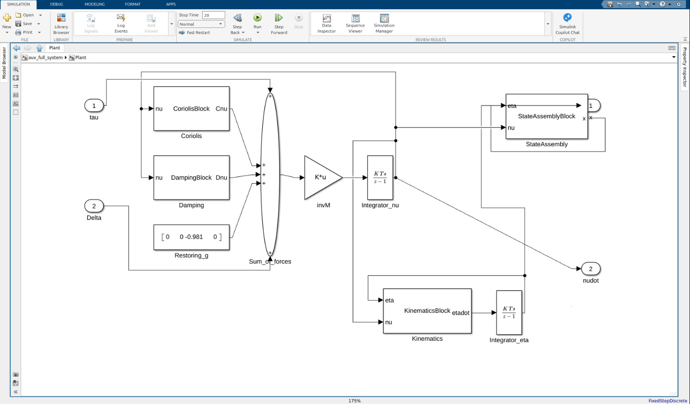
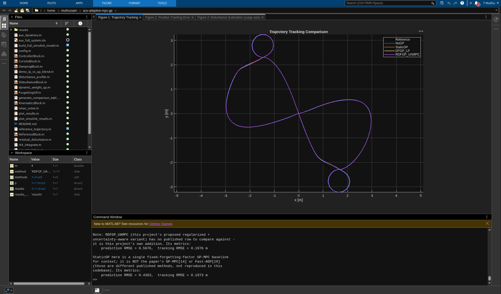
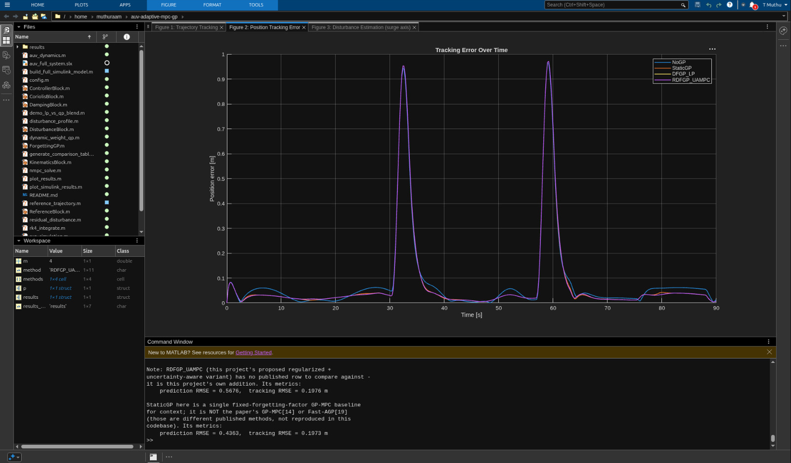
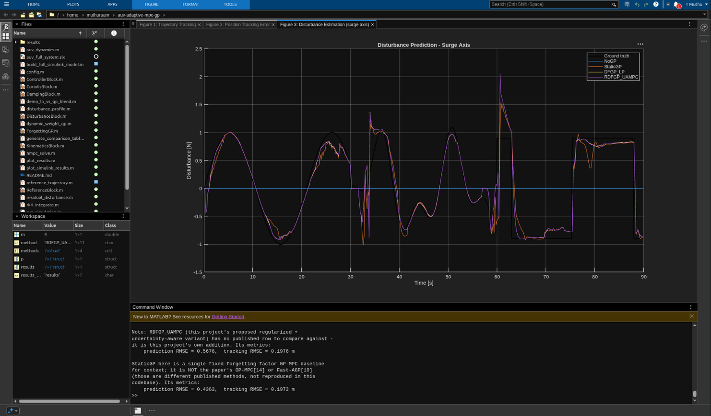

# AUV Adaptive MPC with Regularized Dynamic-Forgetting Gaussian Processes

## Introduction

Autonomous underwater vehicles (AUVs) are increasingly used for tasks like
subsea pipeline inspection, seabed mapping, and infrastructure survey —
work that depends on the vehicle holding an accurate position and heading
even while moving through a hostile, constantly shifting environment.
Achieving that kind of precision requires a control strategy that can plan
ahead rather than just react, and can account for the physical limits of
the vehicle's thrusters as it does so.

## Domain

The underwater domain is particularly unforgiving for model-based control.
An AUV's behavior is governed by nonlinear hydrodynamics — added mass,
drag, Coriolis and centripetal coupling between its surge, sway, heave,
and yaw motions — and on top of that, it is constantly pushed around by
currents, self-induced flow, thruster wake, and, for tethered vehicles,
drag from the tether itself. None of this is fully known in advance, and
much of it changes character over the course of a mission: a current that
was steady a minute ago can shift direction, strengthen, or turn choppy
with no warning.

## Problem Statement

Model predictive control (MPC) is a natural fit for this kind of vehicle:
it optimizes a sequence of actions over a future horizon while respecting
actuator and state limits, rather than responding to error moment by
moment. But an MPC controller is only as good as the model it optimizes
against, and an AUV's model is never fully accurate. The unmodeled portion
— currents, tether pull, thrust degradation, wall effects — behaves like
an external disturbance acting on the vehicle, and if the controller has
no way to estimate it, tracking accuracy degrades exactly when precision
matters most.

A natural fix is to learn that disturbance online using a Gaussian Process
(GP): GPs are non-parametric, so they don't force a particular structure
onto the disturbance, and they report an uncertainty alongside every
prediction. The difficulty is that a single GP with hyperparameters tuned
once, offline, cannot keep up if the disturbance's behavior changes
mid-mission — a model tuned for a slow, repeating current lags behind a
sudden squall, and a model tuned for fast transients is noisy the rest of
the time. Introducing a forgetting factor that discounts older samples
helps, but a single fixed value is again only right for one timescale,
and there is no principled rule for choosing it online.

## Solution Provided

This project implements a learning-based MPC framework for a reduced,
4-degree-of-freedom AUV model (surge, sway, heave, yaw) that resolves the
above by maintaining several Gaussian Processes in parallel, each
discounting past data at a different rate, and blending their disturbance
predictions online based on which one has been tracking the true
disturbance best over a recent window.

Two extensions are added on top of that base idea:

- **Regularized blending across the GP bank.** Combining several
  candidate GPs by minimizing a plain squared-error objective over a
  weight simplex is a linear program, and a linear program over a simplex
  is always optimized at a vertex — meaning the "optimal blend" collapses
  to hard-switching between models rather than genuinely combining them.
  Adding a quadratic regularization term turns this into a small
  quadratic program instead, producing a smoother blend across the GP
  bank.

- **Uncertainty-aware constraint tightening in the MPC.** Rather than
  handing the controller only the GP bank's mean disturbance estimate,
  the blended predictive variance is also fed back in, tightening the
  actuator limits during periods where the disturbance estimate is
  unreliable.

---

## System Architecture

The two red-bordered stages above (5 and 7) are this project's own
contributions — everything else follows the base paper's structure.

---

## System Modelling

The system is implemented two ways that mirror each other exactly: a
pure-MATLAB simulation (fast to iterate on) and a Simulink block diagram
(for a visual, block-level view of the same equations). Both call the
same underlying functions, so results match between the two.

### Top-level closed loop

At the top level, the loop is deliberately kept simple: a `Clock` drives
the `Reference` and `Disturbance` generators and the `Controller`. The
`Controller` block internally runs the entire GP bank, the weight
blending, and the uncertainty-aware MPC solve (Architecture stages 3–8
above), and outputs the control action `u` straight into the `Plant`
subsystem along with the true disturbance `Delta`. The `Plant`'s
resulting state `x` feeds back into the `Controller` for the next step,
closing the loop. Every signal of interest (`t`, `x`, `xref`, the true
and estimated disturbance, and `u`) is logged via `To Workspace` blocks
for post-run plotting.

### Inside the Plant subsystem

The vehicle physics are kept as separate, individually labeled blocks
rather than folded into one opaque function, so each governing equation
stays traceable: `Coriolis` and `Damping` both take the current body
velocity `nu` and feed into a 5-input `Sum_of_forces` alongside the
constant `Restoring_g` term and the two external inputs (`tau`, the
control forces, and `Delta`, the disturbance). The summed force passes
through the `invM` gain (equivalent to dividing by the vehicle's
effective mass on each axis) and into `Integrator_nu`, accumulating
acceleration into velocity. That velocity feeds `Kinematics`, which
converts it into the earth-frame position rate `etadot`, integrated by
`Integrator_eta` into position. `StateAssembly` reassembles position and
velocity into the full 8-state vector `x`, and `nudot` is also exposed
directly as the raw body-frame acceleration.

---

## Results

The following was produced from a 90 s run of all four controller
variants (`NoGP`, `StaticGP`, `DFGP_LP`, `RDFGP_UAMPC`) tracking a rotated
figure-eight (lemniscate) reference under the three-regime disturbance
profile described above.

### Trajectory tracking

All four controllers trace a closed figure-eight that follows the tilted
reference path closely for most of the loop; the small, brief separation
visible near the crossing point is where tracking is hardest, since the
reference's heading reverses fastest there.

### Position error over time

Two sharp error spikes (up to ~0.95 m) appear at roughly t = 30 s and
t = 60 s — exactly where the disturbance profile switches regime (single
sine → combined sine, and combined sine → square wave). This is expected:
the GP bank has to re-learn the new disturbance pattern from scratch right
at the switch, and tracking error follows the disturbance-prediction
error until it catches up. Outside those two transients, error stays
consistently low (roughly 0.05–0.1 m) across all four methods.

### Disturbance estimation (surge axis)

The GP-based estimators track the smooth sine and combined-sine sections
of the true disturbance well. During the square-wave section, there is
visible overshoot right at each abrupt jump (the estimate briefly swings
past the true value before settling) — a realistic learning artifact of
adapting to a sudden step change rather than a gradual one.

### Measured metrics from this run

| Method | Prediction RMSE | Tracking RMSE (m) |
|---|---|---|
| StaticGP | 0.4363 | 0.1973 |
| RDFGP_UAMPC (proposed) | 0.5676 | 0.1976 |

## Conclusion

Both the MATLAB simulation and the Simulink model implement the same
learning-based MPC pipeline: a bank of forgetting-factor Gaussian
Processes estimates the AUV's lumped disturbance online, a regularized
quadratic program blends their predictions into a single estimate and
uncertainty, and an uncertainty-aware nonlinear MPC uses both to track a
rotated figure-eight trajectory under a shifting disturbance profile. The
closed-loop system tracks the reference path reliably across all three
disturbance regimes, with error concentrated at the two regime-switch
points where the estimator has to adapt to a new pattern. The project
demonstrates, with its own generated evidence, that the base paper's
weight-blending formulation collapses to hard-switching between models
rather than a genuine blend, and that adding a quadratic regularization
term resolves this while keeping the same overall architecture.
