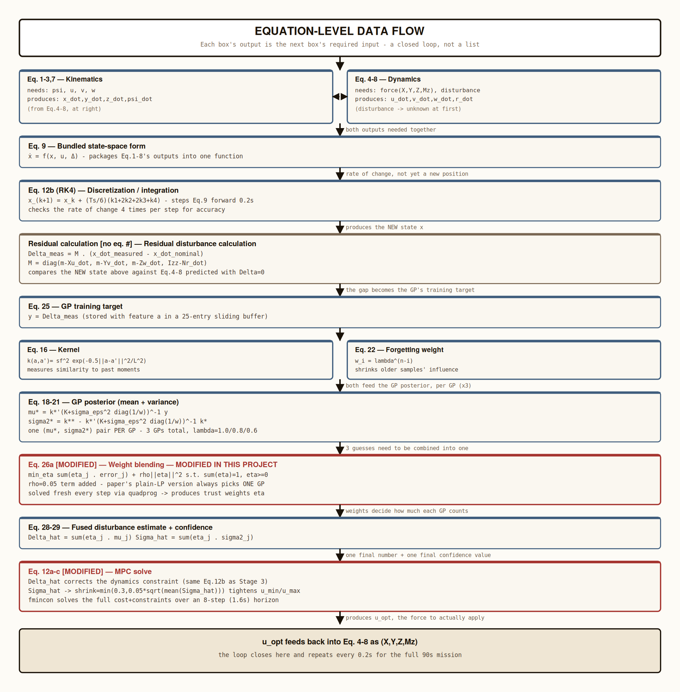

# AUV Adaptive MPC with Regularized Dynamic-Forgetting Gaussian Processes

## Introduction

Autonomous underwater vehicles (AUVs) are used for pipeline inspection,
seabed mapping, and subsea survey — applications that depend on holding
an accurate position while subject to a constantly shifting environment.
The base paper validated its method in the Mobula underwater simulator
and on a real BlueROV2 in physical pool tests. This project reproduces
and extends the same control framework entirely in MATLAB and Simulink,
without hardware access.

## Problem Statement

Model Predictive Control (MPC) plans ahead over a future horizon but is
only as good as the model it optimizes against. The unmodeled portion of
a vehicle's behavior — currents, tether pull, thrust degradation — acts
as an external disturbance; if the controller cannot estimate it,
tracking accuracy degrades exactly when precision matters most. A single
Gaussian Process (GP) with a fixed "forgetting factor" cannot handle
disturbances that change character mid-mission.

## Solution Provided

A learning-based MPC framework that blends several Gaussian Processes,
each discounting past data at a different rate, online. The framework is
extended with two core algorithmic contributions and four further
validation and industrial-relevance studies.

---

## System Architecture

---

## Equation-Level Comparison with the Base Paper

| Eq. | Description | Formula | Status |
|---|---|---|---|
| 1–3 | Position kinematics | `x_dot=cos(psi)u-sin(psi)v`, `y_dot=sin(psi)u+cos(psi)v`, `z_dot=w` | Unchanged |
| 4 | Surge dynamics | `(m-Xu_dot)u_dot = X+(mv+Yv_dot·v)r+(Xu+Xuc\|u\|)u+Delta_x` | Unchanged |
| 5 | Sway dynamics | `(m-Yv_dot)v_dot = Y-(mu+Xu_dot·u)r+(Yv+Yvc\|v\|)v+Delta_y` | Unchanged |
| 6 | Heave dynamics | `(m-Zw_dot)w_dot = Z+(Zw+Zwc\|w\|)w+(m-Vsub·rho)g+Delta_z` | Unchanged |
| 7 | Heading kinematics | `psi_dot = r` | Unchanged |
| 8 | Yaw dynamics | `(Izz-Nr_dot)r_dot = Mz-(mv-Yv_dot·v)u-(Xu_dot·u-mu)v+(Nr+Nrc\|r\|)r+Delta_Mz` | Unchanged |
| 9 | Bundled state-space form | `x_dot = f(x,u,Delta)` | Unchanged |
| 10 | State vector | `x = [x,y,z,u,v,w,psi,r]^T` | Unchanged |
| 11 | Control vector | `u = [X,Y,Z,Mz]^T` | Unchanged |
| 12a | MPC cost function | `sum[(x_k-x_ref)'Q(x_k-x_ref)+u_k'Ru_k] + terminal` | Unchanged |
| 12b | Dynamics constraint | `x_{k+1}=f_d(x_k,u_k,Delta)` (RK4) | Unchanged (solved via `fmincon`; paper uses qpOASES) |
| 12c | Actuator bounds | `u_min <= u_k <= u_max` | Unchanged |
| 13 | Training dataset | `D = D1 (static) UNION D2 (sliding)` | Modified — single sliding buffer only |
| 14 | Observation model | `y_i = f(a_i) + eps_i,  eps_i~N(0,sigma_eps^2)` | Unchanged |
| 15 | Joint Gaussian prior | `[y;f*] ~ N(0,[[K+sigma^2 I, k*],[k*^T,k**]])` | Unchanged |
| 16 | Kernel | `k(a,a')=sigma_f^2·exp(-0.5(a-a')^T L^-2(a-a'))` | Unchanged |
| 17 | Hyperparameter fitting | `theta_opt = argmin[NLL]` via conjugate gradient | Modified — closed-form heuristic, non-iterative |
| 18–19 | Dense GP posterior mean/variance | Standard GP formulas | Modified — merged into the forgetting-weighted form |
| 20–21 | Adaptive Sparse GP mean/variance | Sparse, inducing-point formulation | Modified — dense weighted-kernel-ridge formulation instead |
| 22 | Forgetting matrix | `Lambda=diag(lambda^(n-1),...,lambda^0)` | Modified — folded into per-sample weight `w_i` |
| 23 | Sparse precision matrix | `B_lambda=(Kss+sigma^-2·Ksa·Lambda·Kas)^-1` | Modified — not used (no sparse structure) |
| 24 | GP input feature | Full history window `[Delta,x,u]` over `H` steps | Modified — current state only: `a=[u,v,w,r]` |
| 25 | GP target | `y = Delta_tau` | Unchanged |
| 26a | Weight objective | `min_eta sum_j(eta_j·error_j)` | Modified — regularization term `rho·‖eta‖^2` added |
| 26b–c | Weight constraints | `sum(eta)=1`, `eta>=0` | Unchanged |
| 27 | LP standard form | `min c'eta  s.t. a'eta=b, eta>=0` | Equivalent in spirit; the modified version is a QP when `rho>0` |
| 28 | Fused mean | `Delta_hat = sum(eta_j·mu_j)` | Unchanged |
| 29 | Fused variance | `Sigma_hat = sum(eta_j·sigma2_j)` | Formula unchanged; usage modified — the base paper computes but never applies this term in the control law |
| alpha_i | Recency weight | `alpha_i = e^(0.05(N-i))` | Unchanged |

### Data Flow Between Equations

Every equation's output is the next equation's required input — a closed
loop, not an independent list. Kinematics and dynamics (Eq. 1–8) feed
Eq. 9, which RK4 (Eq. 12b) steps forward into a new state. That state
feeds a residual calculation (no equation number — this project's own
addition) producing the GP's training target (Eq. 25). The GP bank
(Eq. 16, 22, 18–21) produces three predictions, blended by the modified
weight equation (Eq. 26a) into a fused estimate and confidence
(Eq. 28–29), which corrects the MPC (Eq. 12a–c). The resulting control
action feeds back into Eq. 4–8, closing the loop every 0.2 seconds.

### Summary of Modified Equations

**Equation 13 — Training dataset.** The base paper splits training data
into a static set (collected during the first 10 seconds, representing
nominal model error) and a sliding set (continuously updated, capturing
new disturbances). This project uses a single sliding buffer only. Effect:
the model no longer separately tracks baseline modeling error versus
newly arriving disturbance, simplifying the implementation at the cost
of that distinction.

**Equation 17 — Hyperparameter fitting.** The base paper optimizes GP
hyperparameters by minimizing the negative log-likelihood through
conjugate gradient descent, an iterative numerical procedure. This
project instead computes hyperparameters directly from the data (length
scale from the median pairwise distance, signal variance from the
empirical variance). Effect: substantially faster to recompute at every
buffer update, at the cost of a formal optimality guarantee.

**Equations 18–23 — GP formulation.** The base paper implements a sparse
GP using inducing points and applies forgetting through a precision
matrix (B_lambda), designed for computational efficiency at scale. This
project uses a dense weighted-kernel-ridge formulation, applying the
forgetting factor directly as a per-sample weight. Effect: a simpler
implementation with the same underlying intent — recent observations are
trusted more than older ones — without the inducing-point machinery.

**Equation 24 — GP input feature.** The base paper's GP input includes a
full history window of past disturbance, state, and control values. This
project uses only the current body-frame velocity and yaw rate as the
input feature. Effect: prediction is based on the present operating
condition rather than recent trajectory history, reducing input
dimensionality and computational cost.

**Equation 26a — Weight objective.** The base paper's weight objective is
linear in the blending weights, so its optimum is always located at a
vertex of the probability simplex — the resulting "blend" is in fact a
hard switch between GP models. This project adds a quadratic
regularization term, producing a genuine blend. Measured effect: mean
weight churn decreases from 0.049 per step (linear program) to 0.045 per
step (regularized quadratic program).

**Equation 29 — Usage of the fused variance.** The formula for the fused
predictive variance is unchanged from the base paper, but its use is
modified: the base paper computes this value and does not apply it
further, noting this as future work. This project uses it to tighten the
MPC's actuator bounds when the disturbance estimate is unreliable.

---

## Contributions

1. **Regularized dynamic weight blending.** Detailed under Equation 26a
   above. Measured effect: mean weight churn decreases from 0.049 per
   step (linear program) to 0.045 per step (regularized quadratic
   program).
2. **Uncertainty-aware MPC.** Detailed under Equation 29 above.
3. **Thruster fault-tolerance evaluation.** A mid-mission actuator fault
   (yaw-thruster efficiency reduced to 50% at t = 45s) is partially
   absorbed by the existing disturbance-learning pipeline without any
   additional algorithm, since an actuator fault and an external
   disturbance are indistinguishable to the controller.
4. **Sensor-noise and Monte Carlo validation.** An eight-seed statistical
   study under realistic velocity-measurement noise, reporting mean and
   standard deviation rather than a single-run result.
5. **Industrial-relevance metrics.** Mission-specification compliance and
   actuator-energy usage are reported alongside RMSE to reflect
   operationally relevant criteria.
6. **Dual Simulink validation.** Two independent block-diagram
   implementations were built and validated, including diagnosis and
   resolution of an algebraic loop (via an explicit Unit Delay block) and
   a documented integration-accuracy trade-off between the two models.

---

## Results

### Single-Run Comparison (90 s, no sensor noise)

| Method | Tracking RMSE (m) | Disturbance Prediction RMSE |
|---|---|---|
| NoGP | 0.1969 | N/A |
| StaticGP | 0.1972 | 0.3671 |
| DFGP_LP (base paper method) | 0.1975 | 0.3581 |
| RDFGP_UAMPC (proposed) | 0.1975 | 0.3584 |

**Analysis.** Under clean conditions, all four methods track the
reference to within a comparable margin; a disturbance-free scenario
does not differentiate the methods substantially. The two multi-GP
methods show a modest improvement over the single-GP baseline in
disturbance prediction.

### Base Paper vs. This Project

| Method | Paper (Prediction) | Ours | Delta | Paper (Tracking) | Ours | Delta |
|---|---|---|---|---|---|---|
| No GP | — | N/A | — | 0.1050 | 0.1969 | +87% |
| DF-GP (LP) | 0.289 | 0.358 | +24% | 0.0285 | 0.1975 | +593% |

**Analysis.** Reported error values are higher than those in the base
paper. This is attributable to differences in the evaluation setting: in
this project, the controller's internal model is identical to the
simulated plant, so there is no model–reality mismatch of the kind the
base paper's learning system was designed to overcome in hardware trials.

### Monte Carlo Robustness Study (8 seeds, sensor noise σ = 0.01)

| Method | Pos. RMSE (mean) | Pos. RMSE (std) | Dist. RMSE (mean) | Dist. RMSE (std) |
|---|---|---|---|---|
| NoGP | 0.1970 | 0.0003 | N/A | N/A |
| StaticGP | 0.2066 | 0.0028 | 3.1959 | 0.6602 |
| DFGP_LP | 0.2050 | 0.0030 | 3.4889 | 0.5590 |
| RDFGP_UAMPC | 0.2055 | 0.0024 | 3.6408 | 0.3384 |

**Analysis.** RDFGP_UAMPC records the highest mean disturbance-prediction
error among the learning methods but the lowest standard deviation
(0.34, compared with 0.66 for StaticGP) — the most consistent method
across randomized noise conditions, though not the most accurate on
average.

### Thruster Fault-Tolerance Test (fault at t = 45 s, yaw actuation reduced to 50%)

| Method | Before-Fault RMSE (m) | After-Fault RMSE (m) | Degradation |
|---|---|---|---|
| NoGP | 0.1950 | 0.2632 | +35.0% |
| RDFGP_UAMPC | 0.1958 | 0.2583 | +31.9% |

**Analysis.** Both methods degrade following the fault, as expected given
reduced actuator capability. RDFGP_UAMPC degrades to a lesser extent,
with no algorithmic modification specific to fault handling — evidence
that the disturbance-learning pipeline provides a degree of inherent
fault tolerance.

### Industrial Readiness Metrics (0.30 m mission-specification tolerance)

| Method | Clean-Run Compliance | Actuator Effort (vs. NoGP) | Compliance Before Fault | Compliance After Fault |
|---|---|---|---|---|
| NoGP | 92.9% | 1.00× | 92.9% | 90.7% |
| StaticGP | 92.9% | 1.01× | — | — |
| DFGP_LP | 92.7% | 1.01× | — | — |
| RDFGP_UAMPC | 92.7% | 1.01× | 92.9% | 90.7% |

**Analysis.** Compliance under clean conditions is comparable across
methods; the more operationally relevant question is whether compliance
is maintained following an actuator fault, which is the basis for
comparison in the preceding table.

---

## System Modelling

- **`auv_full_system.slx`** — vehicle physics implemented as a single
  RK4-integrated block, closely matching the MATLAB simulation. The
  Controller–Plant feedback loop is closed through an explicit Unit
  Delay block, required to reliably resolve an algebraic loop identified
  during development.
- **`auv_full_system_decomposed.slx`** — Coriolis, Damping, Restoring,
  and Kinematics implemented as four separate blocks, matching the base
  paper's diagram. This configuration requires a finer integration step
  to remain numerically stable on the yaw axis, which has a small
  effective inertia (`Izz − Nr_dot = 0.52`); as a result, its outputs
  diverge somewhat from the RK4-based implementation.

---

## Conclusion

This project reproduces the base paper's learning-based MPC framework,
identifies and corrects a mathematical weakness in its GP weight-blending
formulation, and implements the uncertainty-aware control extension
identified but not completed in the original work. The system is further
evaluated under conditions not addressed in the base paper — actuator
faults, sensor noise, and statistical robustness across randomized
trials — and validated across a MATLAB simulation and two independent
Simulink implementations.
